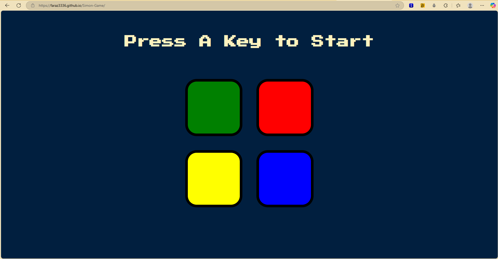

# 🎮 Simon Game – Memory Challenge

A fun and interactive memory-based game built with **HTML**, **CSS**, **JavaScript**, and **jQuery**. This project was created as part of my learning journey in [Angela Yu's Web Development Bootcamp](https://www.udemy.com/course/the-complete-web-development-bootcamp/).

🔗 **Play it here**: [Simon Game Live](https://faraz3336.github.io/Simon-Game/)

---

## 🕹️ How to Play

- Press any key to start the game.
- Repeat the pattern shown by the game.
- The pattern increases by one color each level.
- If you make a mistake, the game is over and you can restart.

---

## 💡 Features

- Fully responsive and interactive gameplay
- Dynamic pattern generation
- Audio feedback for user interaction
- Keyboard event handling
- jQuery-based logic for concise and clean code

---

## 🛠️ Tech Stack

- HTML5
- CSS3
- JavaScript (ES6)
- jQuery

---

## 📸 Preview

 <!-- Replace with actual screenshot if you upload -->

---

## 📚 Learnings

- DOM manipulation using jQuery
- Event listeners and game logic in JavaScript
- Handling user input and pattern validation
- Improved debugging and code organization

---

## 🙋‍♂️ About Me

I’m **Faraz Bin Tariq**, a passionate software developer focused on building full-stack applications and learning through hands-on projects.

📫 Reach me at: usama.tariq131@gmail.com  
📞 Contact: 7011370264  
📍 Location: Noida, India  
🔗 [LinkedIn](https://www.linkedin.com/in/faraz-bin-tariq-316590218)

---

⭐️ _Feel free to fork this repo, play the game, or give it a star if you liked it!_
# Simon-Game
